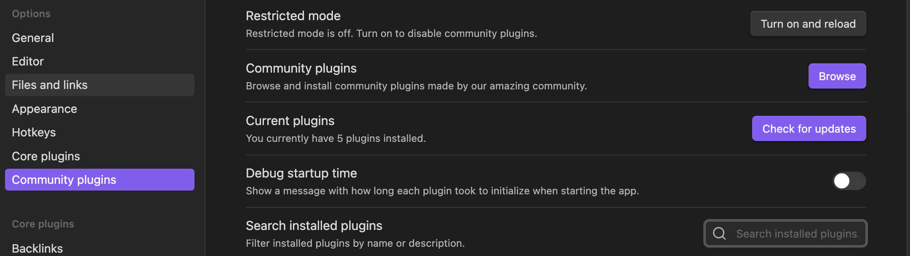
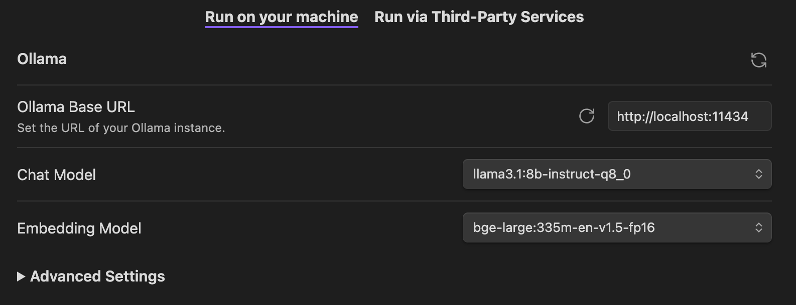
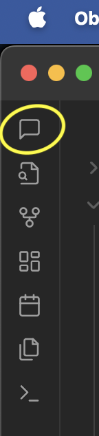
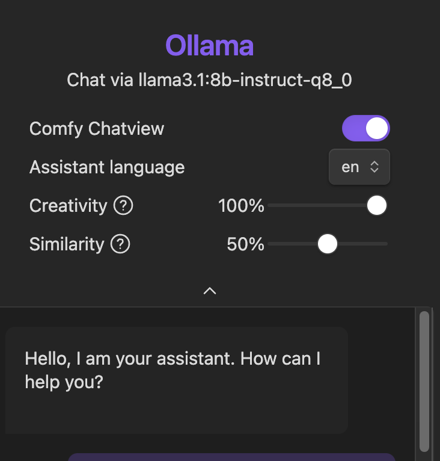

# Self-hosted second brain

## Components needed

1. ollama - ollama helps you self-host and manage your local LLMs, get it from https://ollama.com/download. You can watch more here: https://www.youtube.com/watch?v=90ozfdsQOKo. Ollama is licensed under MIT. 
	1. 1 x LLM model:  llama3.1:8b-instruct-q8_0
	2. 1 x embedding model: nomic-embed-text:137m-v1.5-fp16 - an embedding model helps you to index the input (text, image, video?) into a vector representation for storage and comparison.
2. obsidian - private note taking and management app, saves the files in markdown format. You can get it from: https://obsidian.md/download (get the desktop version). Refer to Obsidian's license here: https://obsidian.md/license
	1. Smart Second Brain - for processing any notes or downloaded articles in Obsidian
	2. Slurp - for saving articles by URL

## Steps
1. Download the ollama suited for your desktop - I am assuming mac here.
2. Install ollama and start the ollama app. You will notice a new llama icon floating in your toolbar area (depending on your OS, settings).
3. Open up your Terminal and do a "ollama run llama3.1:8b-instruct-q8_0"
	1. I am guessing this model will run on your machine (it's around 7.6GB) - if it exhausts all memory, we will need to find a smaller model or used a quantized one)
	2. You will need a wait a few minutes depeneding on your internet download speeds.
	3. Meanwhile, install Obsidian.
	4. Once Ollama has finished downloading the model, you will see something like:

``` cli 
>>> Send a message (/? for help)
```
4. Once you see the message, you are ready to work with Obsidian. You can play a bit to see how it performs, ask it something such as "what can you do?"
5. Once you have enough CLI fun, you can exit with a "/bye" command. 
6. Pull the embedding model via "ollama pull nomic-embed-text:137m-v1.5-fp16". 
7. Start Obsidian up and go to the Settings:
	1. Under "Options" on the left, select the last item "Community Plugins".
	2. Click on the "Browse" button to the right side, just above the "Check for updates" button as shown in Diagram 1.



	3. Search for the "Smart Second Brain" plugin by "leo310" and "nicobraughtgit", currently it's at around 17k installs.
	4. Install that plugin
	5. Go to the SBB Settings/Options.
	6. Default ollama port is 11434, so the "Ollama Base URL" will be "http://localhost:11434"
	7. Select "llama3.1:8b-instruct-q8_0" for the Chat Model
	8. Select "nomic-embed-text:137m-v1.5-fp16" for the Embedding Model
	9. Your settings should be similar to Diagram 2 below:




1. Once configured, I forgot, but you should "quit" your Obsidian app and start it up again.
2. Find the "Open S2B Chat" icon on the left vertical panel as shown in Diagram 2 below.



If configured correctly, then you will be able to see something like in Diagram 4 below in the chat panel to the right:

